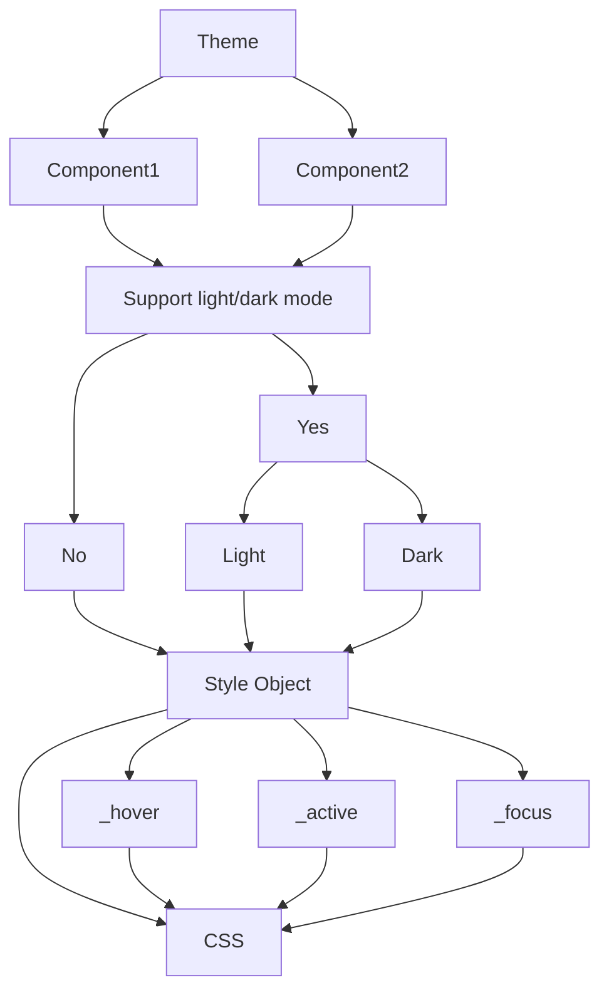
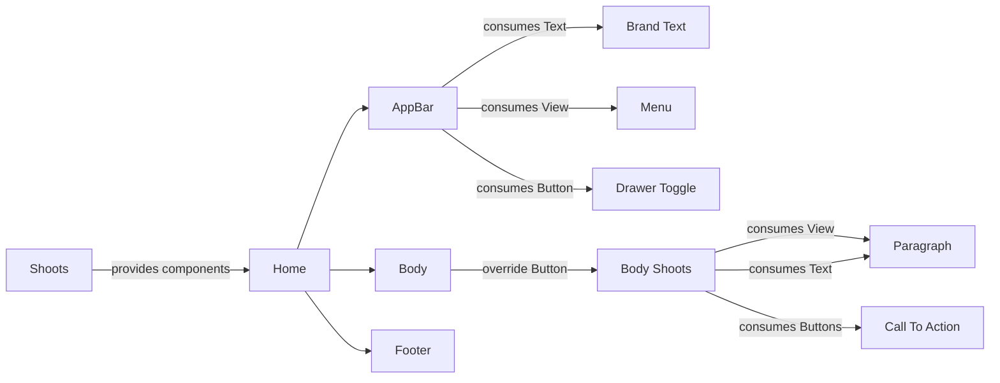

# Bamboo Shoots
The following attributes define Bamboo shoots best:
-   dependency-injection
-   strongly typed
-   well tested
-   highly performant
-   un-styled
-   un-opinionated
-   building-blocks

  
## Goals:

1.  Theme Injection
2.  Component Injection
3.  Component API that mimics react-native
4.  Testing
5.  Performance Benchmarking

  

## Theme Injection

You want to make a library that enables theming by injecting component styles. The library should make efficient use of context to create a simple theming solution.

Build the library with support for Dark/Light theme.

Implement minimal default style to represent an aesthetic UI.

Give the ability to compose elements with different styles using nested react context using Bamboo shoots to make high-level components.

Export access to the context using hooks, Providers and Consumers.

#### User Stories
-   As a developer, I want to inject my styles to create a global custom theme for my components
-   As a developer, I want to toggle between dark and light themes
-   As a developer, I want to inject module level styles at a lower level in the component tree.
-   As a developer, I want to consume the theme in my components; Class OR Function Components
-   As a developer, I want to overwrite the style of my components

#### Acceptance Criteria

-   The components appear cohesive without adding any developer style
-   Components implement the light/dark theme inherited.
-   Components implement the component theme.
-   Components implement custom styles provided inline.
-   Components are allowed to define _hover, _focus, _active styles as necessary
-   useComponentTheme returns a normalised theme taking into consideration the following
-   current theme (light/dark)
-   _hover state
-   _focus state
-   _active state

#### Draft Structure


  

## Component Injection

You want to write a library that allows developers to inject components into the component tree.

The developers to can not only consume, but also replace components in the context using nested context for special cases.

You allow the developers to use the injected dependencies using a useComponent hook or ProvideComponents and ConsumeComponents components.

#### User Stories
-   As a developer, I want to declare my components once at the beginning and use them anywhere in the project.
-   As a developer, I want to be able to consume injected components in my higher-level components
-   As a developer, I want to inject custom components
-   As a developer, I want to make complex components that have other other simple or complex function injected into them.
-   As a developer, I want to be able to inject custom component styles for my composed complex components.
-   As a developer, I want to be able to create Class or Function components
-   As a developer, I want the library to infer the type of the custom injected components.

#### Acceptance criteria
-   A composed component should inherit the styles.
-   A composed component can be injected into other components
-   No circular dependency injection

#### Draft Structure



#### Draft Usage: Hooks
``` jsx
	const SimpleCard = (props) => {
		.
		.
		.
		// Usage as string
		const {View, Button} = useComponent();
		
		return (
			<View>
				<Heading>Heading</Heading>
				<Text>....</Text>
				<Button>Click Me</Button>
			</View>
		)
	}


    const App = () => {
        return (
            // Comes with a default set of low-level components.
            // ProvideComponents is entirely optional; unless you want to overwrite the defaults.
            // Nesting providers allows us to replace components to be rendered deep down in the library
            <ProvideComponents>
                <SimpleCard />
                <ProvideComponents components={{ Button: HtmlButton }}>
                    // Renders HtmlButton as the Button
                    <SimpleCard />
                </ProvideComponents>
            </ProvideComponents>
        )
    }
```
#### Draft Usage: Consumer
``` jsx
    const HtmlButton = (props) => <button {...props} />

	const SimpleCard = (props) => {
		.
		.
		.
		return (
            <ConsumeComponents>
                {
                    ({ View, Heading, Text, Button }) => (
                        <View>
                            <Heading>Heading</Heading>
                            <Text>....</Text>
                            <Button>Click Me</Button>
                        </View>
                    )
                }
            </ConsumeComponents>
		)
	}

    const App = () => {
        return (
            // Comes with a default set of low-level components.
            // ProvideComponents is entirely optional; unless you want to overwrite the defaults.
            // Nesting providers allows us to replace components to be rendered deep down in the library
            <ProvideComponents>
                <SimpleCard />
                <ProvideComponents components={{ Button: HtmlButton }}>
                    // Renders HtmlButton as the Button
                    <SimpleCard />
                </ProvideComponents>
            </ProvideComponents>
        )
    }
```

## Bamboo Testing

You want that the components you've written to be robust and well tested. 

You want to write well documented components. Storybook enables you to write stories for each of your components and create detailed automated testing of your stories.

Bamboo Shoots should implement storybook for the component unit testing needs.

#### User Stories
- As a developer, I want to use components that do not cause random unexpected behavior.
- As a developer, I want to write user stories for the different features of a component.
- As a developer, I want to know the changes between versions.
- As a developer, before I include a component, I want to play with the options/props the component has to offer.
- As a contributor, I want to ensure the changes I make to the library doesn't break anything.
- As a contributor, I want to write test cases for the components I have created.

#### Acceptance Criteria
- All the components are tested
- All the components have a visual test done
- Integration testing with nested theme and composition injection.


  

## Benchmarking
You want to write performant code to ensure the application using your software doesn't run slow.

Bamboo shoots components will be tested for performance in comparison against react-native components for mobile and HTML elements for the web. A performance baseline for all the components needs be established.

Create components and hooks that are memoized and do not update every render.

#### Acceptable Criteria
- At most 5% performance degradation compared to react-native for mobile and html for browser.
- No additional performance degradation owing to theming and context.

 
## Component API

You should write Bamboo shoots components that are drop-in replacements for react-native components and vice-versa.

The typed interface for Bamboo shoot will always be same as that of react-native/react-native-web components.

The custom components that are unique to Bamboo Shoots also follow an API similar to react-native naming convention for props. That means, for example: click handler callback would be `onPress` instead of ~~`onClick`~~.

The developers who adopt the system should have to learn one library, that is react-native.

#### Acceptable Criteria
- Same API as react-native on mobile
- Same API as react-native-web for web